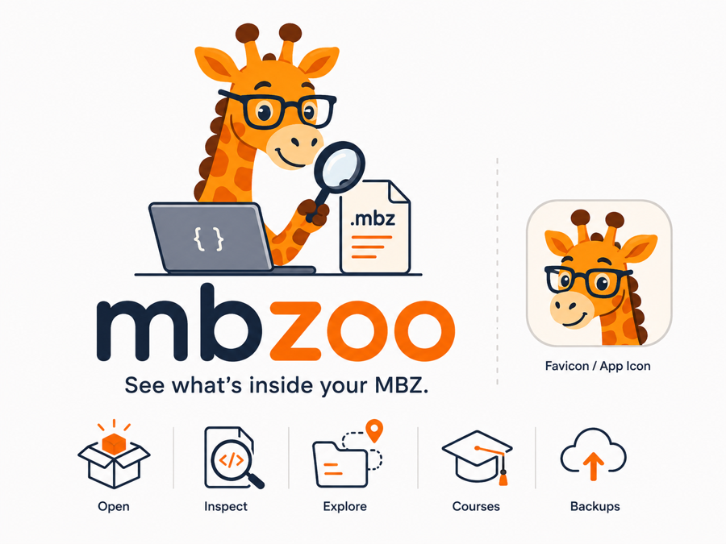

<p align="center">
  
</p>

# MBZoo

[](https://github.com/ateeducacion/mbzoo/actions/workflows/ci.yml)
[](https://codecov.io/gh/ateeducacion/mbzoo)
[](https://ateeducacion.github.io/mbzoo/docs/)
[](LICENSE)

*See what's inside your MBZ.*

MBZoo opens **Moodle course backups** (`.mbz`) directly in your browser — no
Moodle installation, no upload. Drop a backup and inspect its structure,
content and files locally.

**Status: bootstrap / experimental.** Works today: ZIP + TAR.GZ detection,
metadata parsing, course tree, and content previews for pages, labels, URLs,
resources (PDF via pdf.js, images, text, sandboxed HTML websites), quizzes
(read-only question navigation — random slots page through the pool they draw
from), lessons (branching pages and where each jump leads), choices, feedback
questionnaires, database field schemas, workshops, IMS content packages,
glossaries, books, forum/chat/wiki summaries, assignment summaries, inline
video and audio, and unknown-plugin fallbacks.
Course links the backup encoded as `$@…@$` tokens resolve to the activity in
this backup or to the original site, and are never fetched (ADR-0019).
Experimental H5P playback runs inside the same opaque-origin sandbox
(ADR-0018). Each activity can also be exported on its own —
its module XML, its rendered content as a standalone HTML file, or its
attached files as a ZIP. Whole-backup re-packaging and everything else is
planned — see the
[activity support guide](https://ateeducacion.github.io/mbzoo/docs/guide/activity-support.html).

## Try it

- **Viewer**: https://ateeducacion.github.io/mbzoo/ (example backups included)
- **Documentation**: https://ateeducacion.github.io/mbzoo/docs/
- **For AI agents**: [llms.txt](https://ateeducacion.github.io/mbzoo/llms.txt) · [full markdown](https://ateeducacion.github.io/mbzoo/llms-full.txt)
- **CLI**: `bun run cli -- <file.mbz>`

## Privacy

Local-first by construction: the viewer is a static site with no backend;
parsing happens on your device. See `docs/PRIVACY.md`.

## Development

```bash
bun install
bun run dev:viewer      # viewer at http://localhost:5173
bun run docs:dev        # documentation site
bun run check           # lint + typecheck + tests + coverage + build + research validation
```

More: the [documentation site](https://ateeducacion.github.io/mbzoo/docs/),
`DEVELOPMENT.md`, `docs/ARCHITECTURE.md`, `CONTRIBUTING.md`. Decision records
and the evidence system live under `research/`.

## License

GPL-3.0-or-later — see `LICENSE` (ADR-0035).

    Copyright (C) 2026 ateeducacion

    This program is free software: you can redistribute it and/or modify it
    under the terms of the GNU General Public License as published by the Free
    Software Foundation, either version 3 of the License, or (at your option)
    any later version. It is distributed WITHOUT ANY WARRANTY; see the GNU
    General Public License for more details.

Moodle compatibility was achieved by studying documented format facts, not by
porting Moodle code.

### Bundled third-party code

The built viewer bundle ships the H5P core client scripts from
`h5p-standalone` (see `apps/viewer/package.json` for the pinned version), whose
maintainers confirmed the distributed bundle carries GPL-3.0 H5P code
(tunapanda/h5p-standalone#188). Its corresponding source is the published npm
package and https://github.com/tunapanda/h5p-standalone. Other bundled
dependencies are MIT, ISC or Apache-2.0; `research/compliance/licensing/dependency-report.md`
lists them.
